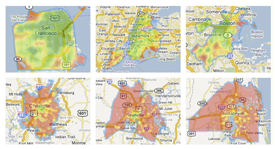

# Exercise 3.1



Heat maps of walkability of major US cities. A greener color indicates a
more walkable area, where a redder color indicates a less walkable area.
Source: <https://www.planetizen.com/node/47154>

Sustainability-related data sets 1.
<https://www.walkscore.com/cities-and-neighborhoods/> 2.
<https://www.kaggle.com/datasets/doaaalsenani/usa-cers-dataset/data>

Learning objectives

-   Report being a self-aware and reflective practitioner with values,
    empathy, and guardianship of one’s environment
-   Examine norms, biases, and values that underlie one’s behaviors
    (i.e., normative thinking and cognitive dissonance)
-   Identify dynamic impacts between and among different parts of the
    system (i.e., social, environmental, and economic considerations)

Sustainability-related questions/issues

-   North American car-centrism and walkability
-   High speed rail vs air travel
-   Impact of college students (waste when moving out of dorms,
    increased air travel)

# Exercise 3.2

```{r}         
library(lterdatasampler)
data("ntl_icecover")
```

The units of observation are number of days between the freeze and breakup of each lake. There are 334 observations.

```{r}         
head(ntl_icecover, n=12)
```
All variable names:
```{r}
names(ntl_icecover)
```
Class of variables:
```{r}
class(ntl_icecover$lakeid)
class(ntl_icecover$ice_off)
```
Unique entries:
```{r}
unique(ntl_icecover$lakeid)
```
